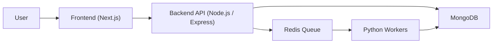

# TaskForge

## Overview

TaskForge is a distributed full-stack application for asynchronous text-processing jobs. Users register and log in through a Next.js frontend, create tasks through a Node.js API, and receive live task status updates while Python workers process jobs from a Redis queue and persist results in MongoDB.

## Architecture



## Tech Stack

- Next.js 16
- Node.js + Express
- Python worker
- Redis
- MongoDB
- Docker Compose
- Kubernetes
- Argo CD
- GitHub Actions

## Features

- JWT-based authentication
- Task creation from the dashboard
- Async Redis-backed processing
- Live status tracking and logs
- Horizontal worker scaling
- Dockerized local deployment
- Kubernetes deployment with health checks and ingress
- GitOps-ready Argo CD application manifest

## Project Structure

```text
backend/     Node.js API
frontend/    Next.js dashboard
worker/      Python async worker
infra/k8s/   Kubernetes manifests
.github/     GitHub Actions workflow
```

## Local Setup with Docker Compose

From the project root:

```powershell
docker compose up --build
```

Application endpoints:

- Frontend: [http://localhost:3000](http://localhost:3000)
- Backend: [http://localhost:5000](http://localhost:5000)

## Kubernetes Deployment

1. Enable a Kubernetes cluster such as Docker Desktop Kubernetes.
2. Push the application images to Docker Hub.
3. Apply the manifests:

```powershell
cd C:\Users\Piyush\Desktop\root\infra\k8s
kubectl apply -f namespace.yaml
kubectl apply -f configmap.yaml
kubectl apply -f secret.example.yaml
kubectl apply -f mongo.yaml
kubectl apply -f redis.yaml
kubectl apply -f backend.yaml
kubectl apply -f worker.yaml
kubectl apply -f frontend.yaml
kubectl apply -f ingress.yaml
```

4. Verify:

```powershell
kubectl get pods -n taskforge
kubectl get svc -n taskforge
kubectl get ingress -n taskforge
```

## Argo CD Setup

Install Argo CD:

```powershell
kubectl create namespace argocd
kubectl apply -n argocd -f https://raw.githubusercontent.com/argoproj/argo-cd/stable/manifests/install.yaml
```

Apply the application manifest:

```powershell
kubectl apply -f infra/argocd-app.yaml
```

Access the UI:

```powershell
kubectl port-forward svc/argocd-server -n argocd 8080:443
```

Then open [https://localhost:8080](https://localhost:8080).

## CI/CD

The GitHub Actions workflow in [.github/workflows/deploy.yml](C:/Users/Piyush/Desktop/root/.github/workflows/deploy.yml:1) builds and pushes backend, frontend, and worker images on every push to `main`.

Required repository secrets:

- `DOCKER_USERNAME`
- `DOCKER_PASSWORD`

## Scaling Notes

- Workers are stateless Redis consumers and can be scaled horizontally.
- The Kubernetes worker deployment starts with 2 replicas.
- Backend, frontend, Redis, and Mongo have resource requests and limits configured.

## Documentation

For the architecture write-up, see [ARCHITECTURE.md](C:/Users/Piyush/Desktop/root/ARCHITECTURE.md:1).

## Screenshots to Include in Submission

- Dashboard UI showing tasks and status
- Kubernetes pod status
- Argo CD application dashboard
- Ingress-hosted application route
