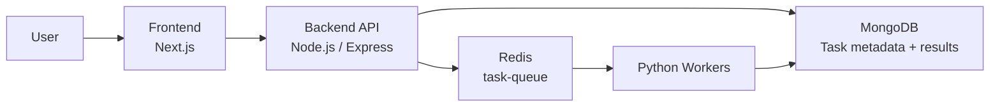
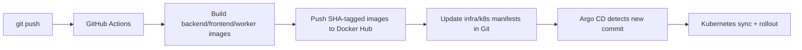
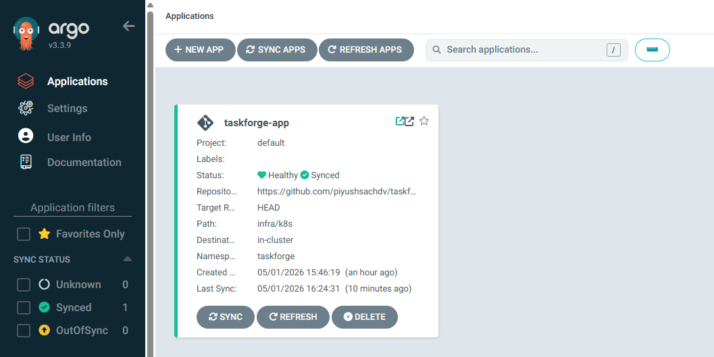
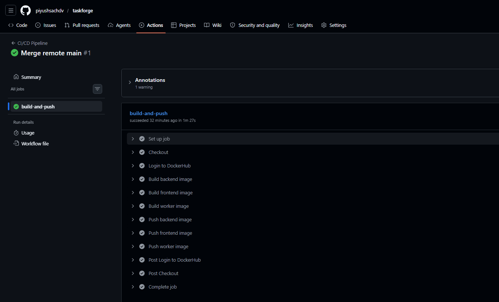
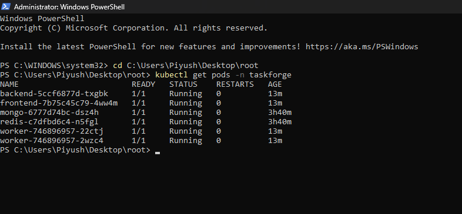
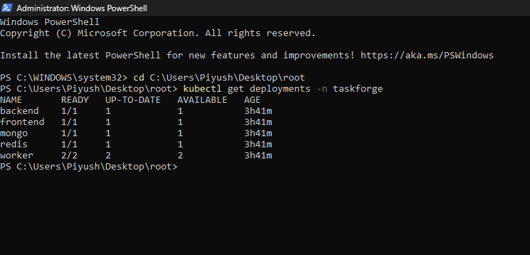
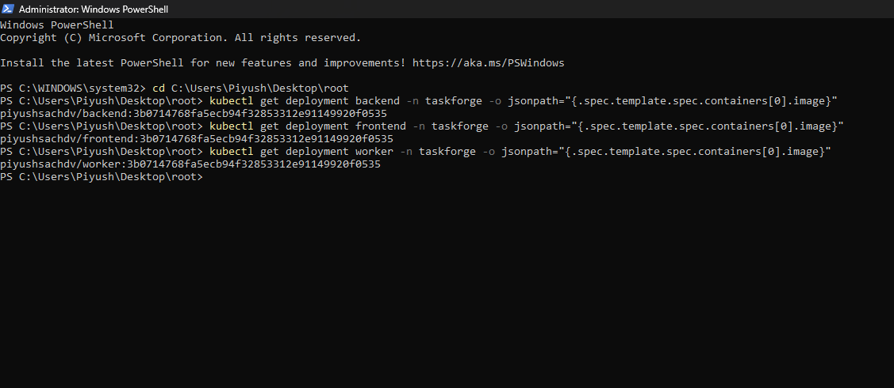
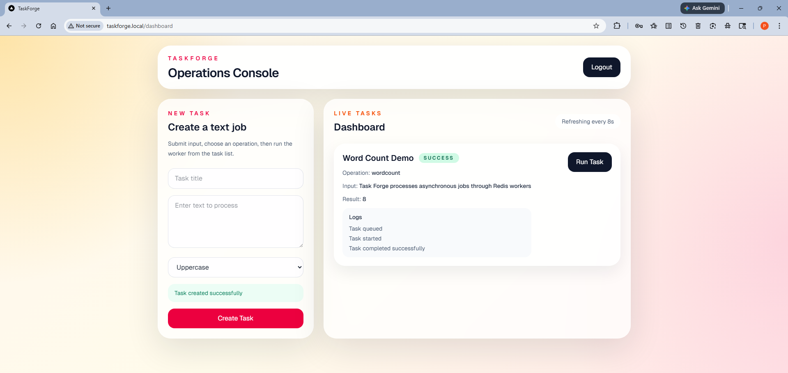
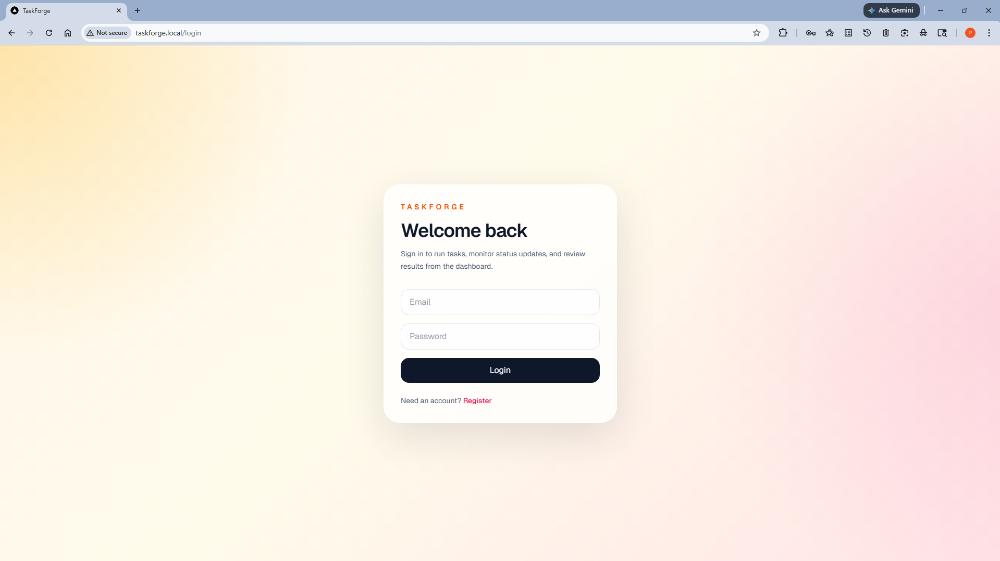

# TaskForge

TaskForge is a distributed full-stack platform for asynchronous text-processing jobs. It combines a Next.js frontend, a Node.js/Express API, Redis-backed queueing, Python workers, MongoDB persistence, Dockerized services, Kubernetes deployment, GitOps with Argo CD, and CI/CD with GitHub Actions.

## What This Project Demonstrates

- Full-stack application with authentication and task lifecycle management
- Distributed architecture with decoupled API, queue, worker, and database layers
- Asynchronous processing using Redis and horizontally scalable workers
- Containerized services for local and cluster deployment
- Kubernetes manifests for namespace-scoped deployment in `taskforge`
- GitOps delivery with Argo CD auto-sync and self-healing
- CI/CD pipeline that builds images, pushes them to Docker Hub, updates manifests in Git, and lets Argo CD deploy the new version

## Architecture



## End-to-End Delivery Flow



## Tech Stack

- Frontend: Next.js 16, React 19
- Backend: Node.js, Express, Mongoose
- Worker: Python
- Queue: Redis
- Database: MongoDB
- Containerization: Docker, Docker Compose
- Orchestration: Kubernetes
- GitOps: Argo CD
- CI/CD: GitHub Actions

## Core Features

- User registration and login
- JWT-protected backend routes
- Task creation and execution from the dashboard
- Async queue-based processing with Redis
- Live task status, logs, and result polling
- Horizontal worker scaling with multiple replicas
- Health checks and resource limits in Kubernetes
- Automated GitOps deployment from GitHub to Kubernetes

## Repository Structure

```text
backend/              Express API and MongoDB models
frontend/             Next.js application
worker/               Python worker service
infra/k8s/            Kubernetes manifests
.github/workflows/    GitHub Actions CI/CD pipeline
ARCHITECTURE.md       Architecture notes and scaling strategy
README.md             Project overview and deployment guide
```

## How The System Works

1. A user registers or logs in through the frontend.
2. The frontend stores a JWT and calls the backend API.
3. A task is created in MongoDB with status metadata.
4. When the user runs a task, the backend pushes a job into the Redis queue.
5. Python workers consume jobs asynchronously and update the task in MongoDB.
6. The frontend polls the backend and renders live status, logs, and final output.

## Local Development

From [docker-compose.yml](C:\Users\Piyush\Desktop\root\docker-compose.yml):

```powershell
docker compose up --build
```

Local endpoints:

- Frontend: [http://localhost:3000](http://localhost:3000)
- Backend API: [http://localhost:5000](http://localhost:5000)

## Kubernetes Deployment

Kubernetes manifests live in [infra/k8s](C:\Users\Piyush\Desktop\root\infra\k8s).

Apply the stack:

```powershell
cd C:\Users\Piyush\Desktop\root\infra\k8s
kubectl apply -f namespace.yaml
kubectl apply -f configmap.yaml
kubectl apply -f secret.example.yaml
kubectl apply -f mongo.yaml
kubectl apply -f redis.yaml
kubectl apply -f backend.yaml
kubectl apply -f worker.yaml
kubectl apply -f frontend.yaml
kubectl apply -f ingress.yaml
```

Verify:

```powershell
kubectl get pods -n taskforge
kubectl get deployments -n taskforge
kubectl get ingress -n taskforge
```

Current namespace:

- `taskforge`

Important runtime config from [infra/k8s/configmap.yaml](C:\Users\Piyush\Desktop\root\infra\k8s\configmap.yaml):

- `MONGO_URI=mongodb://mongo-service:27017/taskforge`
- `REDIS_HOST=redis-service`
- `NEXT_PUBLIC_API_URL=http://backend-service:5000/api`

## GitOps With Argo CD

Argo CD is configured through [app.yaml](C:\Users\Piyush\Desktop\root\app.yaml) and [infra/argocd-app.yaml](C:\Users\Piyush\Desktop\root\infra\argocd-app.yaml).

Application source:

- Repo: [https://github.com/piyushsachdv/taskforge](https://github.com/piyushsachdv/taskforge)
- Path: `infra/k8s`
- Namespace: `taskforge`

Apply the app:

```powershell
kubectl apply -f C:\Users\Piyush\Desktop\root\app.yaml
kubectl get applications -n argocd
```

Expected healthy state:

- Sync status: `Synced`
- Health status: `Healthy`

## CI/CD Pipeline

The pipeline is defined in [.github/workflows/deploy.yml](C:\Users\Piyush\Desktop\root\.github\workflows\deploy.yml).

On every push to `main` that changes app code or the workflow:

1. GitHub Actions builds backend, frontend, and worker images
2. Images are pushed to Docker Hub with the Git commit SHA as the tag
3. The workflow updates `infra/k8s/*.yaml` image references in Git
4. The workflow commits those manifest changes back to `main`
5. Argo CD detects the new Git revision and rolls out the updated images

Required GitHub repository secrets:

- `DOCKER_USERNAME`
- `DOCKER_PASSWORD`

Deployment proof can be verified with:

```powershell
kubectl get application taskforge-app -n argocd
kubectl get deployment backend -n taskforge -o jsonpath="{.spec.template.spec.containers[0].image}"
kubectl get deployment frontend -n taskforge -o jsonpath="{.spec.template.spec.containers[0].image}"
kubectl get deployment worker -n taskforge -o jsonpath="{.spec.template.spec.containers[0].image}"
```

## Scaling And Reliability Notes

- Workers are stateless Redis consumers and can scale horizontally
- The worker deployment starts with 2 replicas
- MongoDB task queries are indexed by `userId`, `createdAt`, and `status`
- Resource requests and limits are defined for cluster scheduling safety
- Argo CD auto-sync, prune, and self-heal reduce drift

## Submission Proof Checklist

- Frontend dashboard screenshot
- `kubectl get pods -n taskforge` screenshot
- Argo CD application screenshot showing `Synced` and `Healthy`
- GitHub Actions screenshot showing a green pipeline
- Optional screenshot of SHA-tagged deployment images

## Screenshots

### Argo CD


### GitHub Actions


### Kubernetes Pods


### Kubernetes Deployments


### SHA-Tagged Deployment Images


### Frontend Dashboard


### Frontend Login


## Additional Documentation

See [ARCHITECTURE.md](C:\Users\Piyush\Desktop\root\ARCHITECTURE.md) for scaling strategy, indexing, Redis failure handling, and environment design.
